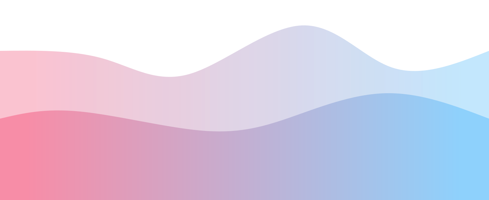

<!-- 🌈 Animated Wave Banner -->

  

  

  
  
  

---

## 🐾 About Me

Hi! I’m a full-stack software engineer with a love for playful interfaces, clean code, and creative projects.  
I enjoy blending logic with visual flair and turning ideas into engaging user experiences.

🎮 Gamified pet projects  
📚 Collector of pretty books and cool art  
👯‍♀️ People person who thrives in team collabs  
🌱 Currently upskilling via Adobe Digital Academy + GA

---

## 🚀 Projects

### 🐱 [Task Buddy](https://task-buddy-app-9018ca12f5dd.herokuapp.com/)  
A gamified to-do list where completing tasks rewards you with virtual pet interactions and level-ups.  
Built with: Node.js, Express, MongoDB, EJS

**Tech Stack:**

---

## 🛠️ Skills

### 💻 Languages & Frameworks

---

### 🛢️ Databases & Tools

---

### 📜 Certifications

---

## 📈 GitHub Stats

  

---

## 💬 Fun Facts

🎨 I dabble in digital art and UI design  
🕹️ I'm always looking for cool games and interactive projects  
📚 Aesthetically pleasing books? Yes, please  
🐾 If I could build an app about anything... it’d probably have a cat in it
